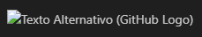

# Sintaxe: Readme.md

## 1. Introdução

Um README.md é um documento crucial para qualquer projeto de software. Ele fornece uma visão geral do projeto, instruções para instalação, uso e contribuição. Neste documento você encontrará algumas diretrizes para escrever um README.md claro e informativo através das linguagens Markdown, HTML e CSS.

### 1.1 Estrutura Básica

Um README.md bem organizado geralmente inclui as seguintes seções:

1.	**Título e Descrição Breve:** Uma breve descrição do projeto e seu propósito.

2.	**Instruções de Instalação:** Como instalar e configurar o projeto localmente.

3.	**Como Usar:** Instruções detalhadas sobre como usar o projeto. Isso pode incluir exemplos de código, comandos de terminal, ou demonstrações visuais.

4.	**Contribuição:** Orientações para contribuir com o projeto, incluindo instruções para reportar problemas, enviar solicitações de pull, e diretrizes de estilo de código.

5.	**Licença:** A licença sob a qual o projeto está disponível.

6.	**Créditos:** Agradecimentos a colaboradores, bibliotecas de terceiros ou recursos utilizados no projeto.

7.	**Contato:** Informações de contato para os mantenedores do projeto.

###	1.2 Dicas para escrever

1.	**Clareza e Concisão:** Use uma linguagem clara e direta. Evite jargões técnicos desnecessários e mantenha o texto conciso.

2.	**Formatação:** Use formatação adequada para tornar o README.md legível. Isso inclui títulos, listas, código formatado e destaques quando necessário.

3.	**Exemplos e Demonstrações:** Forneça exemplos práticos sempre que possível. Isso ajuda os usuários a entenderem rapidamente como usar o projeto.

4.	**Links e Referências:** Inclua links para a documentação adicional, tutoriais, ou recursos relevantes.

5.	**Mantenha Atualizado:** Mantenha o README.md atualizado à medida que o projeto evolui. Inclua informações sobre novas versões, alterações significativas, ou atualizações de dependências.

6.	**Seja Inclusivo:** Torne o README.md amigável e inclusivo para usuários de todos os níveis de habilidade. Explique conceitos complexos quando necessário e forneça recursos para aprendizado adicional.

## 2. Exemplo de Arquivo

Aqui está um exemplo básico de como a estrutura de um README.md pode parecer:

  

Figura 1 - Exemplo de estrutura README.md  

No editor de código VS Code, é possível obter uma pré-visualização de como o arquivo será exibido ao usuário. Para isso, utilize o atalho **Ctrl + Shift + V**.

  

Figura 2 - Pré-visualização do README.md no editor de código VS Code  

## 3. Sintaxe

As sintaxes possíveis para escrever um README.md ou qualquer arquivo Markdown oferecem uma variedade de maneiras de formatar o texto e incluir elementos como cabeçalhos, listas, links, imagens, blocos de código e muito mais. Aqui estão algumas das sintaxes comuns em Markdown:

###	3.1 Títulos

Cada # adicionado reduz o tamanho do título.

  

Figura 3 – Títulos  

Observe a pré-visualização:

  

Figura 4 - Títulos: Pré-visualização  

###	3.2 Listas

Neste capítulo apresentaremos duas formas diferentes de listas: as Listas Não Ordenadas e as Ordenadas.

#### 3.2.1 Não ordenadas

  

Figura 5 - Lista não ordenada  

Observe a pré-visualização:

  

Figura 6 - Lista não ordenada: Pré-visualização  

#### 3.2.2 Ordenadas

  

Figura 7 - Lista ordenada  

Observe a pré-visualização:

  

Figura 8 - Lista ordenada: Pré-visualização  

### 3.3 Links

  

Figura 9 – Links  

Observe a pré-visualização:

  

Figura 10 - Links: pré-visualização  

### 3.4 Imagens

Aqui apresentaremos duas visualizações, a do Texto Alternativo e a da Imagem, observe:

  

Figura 11 – Imagens  

Observe a pré-visualização do Texto Alternativo:

  

Figura 12 - Imagens (Texto Alternativo): Pré-visualização  

Agora observe a visualização da imagem:

  

Figura 13 - Imagens: Pré-visualização  

### 3.5 Blocos de código

Neste capítulo apresentaremos duas formas diferentes de exibir Blocos de Código: Inline e em Bloco.

#### 3.5.1 Inline

  

Figura 14 - Bloco de código inline  

Observe a pré-visualização:

  

Figura 15 – Bloco de código inline: Pré-visualização  

#### 3.5.2 Bloco

Neste modo de exibição, é necessário especificar também a linguagem, da seguinte forma:

  

Figura 16 - Bloco de código  

Observe a pré-visualização:

  

Figura 17 - Bloco de código: Pré-visualização  

### 3.6 Ênfase e estilo

  

Figura 18 - Ênfase e estilo  

Observe a pré-visualização:

  

Figura 19 - Ênfase e estilo: Pré-visualização  

### 3.7 Linhas Horizontais

  

Figura 20 - Linhas Horizontais  

Observe a pré-visualização:

  

Figura 21 - Linhas Horizontais: Pré-visualização  

### 3.8 Citações

  

Figura 22 – Citações  

Observe a pré-visualização:

  

Figura 23 - Citações: Pré-visualização  

### 3.9 Tabelas

  

Figura 24 – Tabelas  

Observe a pré-visualização:

  

Figura 25 - Tabelas: Pré-visualização  

### 3.10 Listas de Tarefas

  

Figura 26 - Listas de Tarefas  

Observe a pré-visualização:

  

Figura 27 - Listas de Tarefas: Pré-visualização  

## 4. Utilização de HTML e CSS

Além da Linguagem Markdown, é possível utilizar também HTML e CSS para customizar esses documentos. Observe:

  

Figura 28 - Utilização de HTML e CSS para customização  

É importante ressaltar que até o momento, o GitHub não reconhece o atributo **style** ao exibir o arquivo.

## 5. Conclusão

Um README.md bem escrito é essencial para garantir que os usuários compreendam e possam utilizar seu projeto de maneira eficaz. Ao seguir estas diretrizes e fornecer informações claras e úteis, você ajudará a construir uma comunidade em torno do seu projeto e facilitará a colaboração e o uso por outros desenvolvedores.